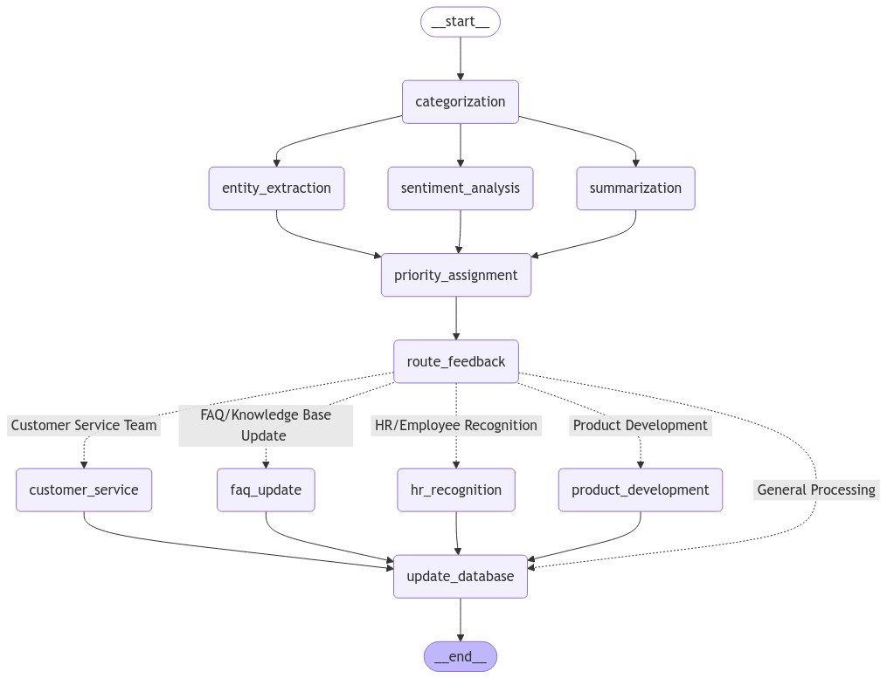
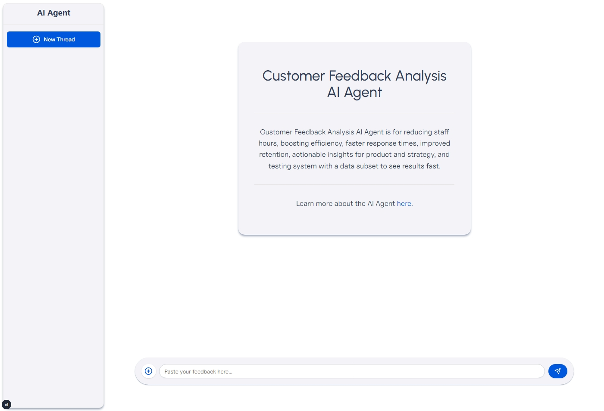
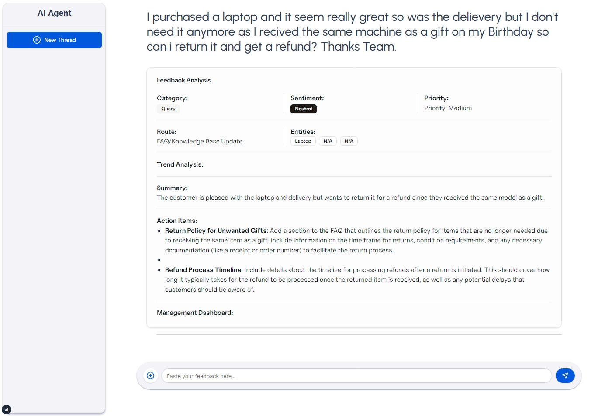

# Custom Feedback Analysis AI Agent

### Agent Workflow



### Agent in Action




This project is a Customer Feedback Analysis AI Agent that generates insights and action items based on customer feedback.

It is powered by `LangGraph`, `Vercel AI SDK`, `gpt-4o-mini`, `FastAPI`, and `Next.js`.

## Tech Stack

- [LangGraph](https://langchain-ai.github.io/langgraph/)
- [Vercel AI SDK](https://sdk.vercel.ai/docs/introduction)
- [OpenAI GPT-4o Mini](https://platform.openai.com/docs/models/gpt-4o-mini)
- [FastAPI](https://fastapi.tiangolo.com/)
- [Next.js App Router](https://nextjs.org/)

## Try it out

1. Clone the repository:

   ```bash
   git clone https://github.com/ahmad2b/customer-feedback-analysis-ai-agent.git
   ```

2. Create a `.env` file based on the `.env.example` file and add your API in both `agent-service` and `agent-ui` directory.

3. Install the dependencies for `agent-service`:

   ```bash
   cd agent-service
   poetry install
   ```

4. Run the development server for `agent-service`:

   ```bash
    poetry run uvicorn app.main:app --reload
   ```

5. Install the dependencies for `agent-ui`:

   ```bash
    cd agent-ui
    npm install
    # or
    yarn install
    # or
    pnpm install
   ```

6. Run the development server for `agent-ui`:

   ```bash
    npm run dev
    # or
    yarn dev
    # or
    pnpm dev
   ```

7. Open http://localhost:3000 with your browser to see the result.

8. Paste your customer feedback in the input box and press `Enter` to generate insights and action items.

---

Agent UI inspired by [Vercel Template](https://vercel.com/templates/next.js/rsc-genui)
